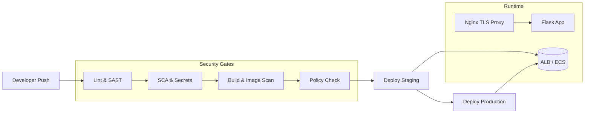

# Secure Pipeline Template

<p align="center">
  <a href="https://github.com/adurrr/secure-pipeline-template/actions/workflows/ci.yml">
    
  </a>
  <a href="LICENSE">
    
  </a>
  <a href="https://semgrep.dev">
    
  </a>
  <a href="https://trivy.dev">
    
  </a>
</p>

<p align="center">
  A production-ready CI/CD pipeline template with integrated security scanning,<br>
  infrastructure as code, and policy enforcement.
</p>

<p align="center">
  <a href="#quick-start">Quick Start</a> •
  <a href="#architecture">Architecture</a> •
  <a href="#features">Features</a> •
  <a href="#customizing-for-your-project">Customization</a> •
  <a href="#contributing">Contributing</a>
</p>

---

## Overview

The **Secure Pipeline Template** provides a hardened, opinionated foundation for deploying containerized services. Security gates are embedded directly into the CI/CD pipeline so that vulnerabilities, misconfigurations, and secrets are caught **before** they reach production.

Every commit is scanned with six independent security tools. Infrastructure is defined as code and validated against custom OPA policies. Deployments target either a local Docker Compose stack or AWS ECS Fargate with minimal configuration changes.

**Supported environments:** AWS, on-premise, or local — out of the box.

---

## Table of Contents

- [Overview](#overview)
- [Architecture](#architecture)
- [Features](#features)
- [Prerequisites](#prerequisites)
- [Quick Start](#quick-start)
  - [Local / On-Premise](#local--on-premise)
  - [AWS](#aws)
- [Running Security Scans Locally](#running-security-scans-locally)
- [Pipeline Stages](#pipeline-stages)
- [Security Scanning Thresholds](#security-scanning-thresholds)
- [Repository Structure](#repository-structure)
- [Technology Stack](#technology-stack)
- [Customizing for Your Project](#customizing-for-your-project)
- [Contributing](#contributing)
- [Security Disclosure](#security-disclosure)
- [License](#license)

---

## Architecture



- **Nginx** handles TLS termination, HTTP-to-HTTPS redirection, rate limiting, and security headers.
- **Flask** application runs as a non-root user inside a read-only container.
- **AWS** infrastructure uses private subnets, VPC flow logs, encrypted S3 buckets, and IAM roles with least privilege.

---

## Features

| Layer | Tools | Purpose |
|-------|-------|---------|
| **SAST** | Semgrep | Static analysis on every push |
| **SCA** | Trivy | Dependency vulnerability scanning |
| **Container** | Trivy, Hadolint | Image scanning + Dockerfile linting |
| **Secrets** | Gitleaks | Pre-commit and CI secret detection |
| **IaC** | Checkov, Trivy | Terraform misconfiguration scanning |
| **Policy** | OPA / Conftest | Custom Rego policy enforcement |
| **Infrastructure** | Terraform | AWS ECS Fargate (optional) |
| **Local / On-prem** | Docker Compose + Nginx | TLS, rate limiting, hardened containers |
| **Monitoring** | CloudWatch or stdout logs | Security alerts and audit logging |

---

## Prerequisites

- [Docker](https://docs.docker.com/get-docker/) — for local and on-premise deployments
- [Terraform](https://developer.hashicorp.com/terraform/tutorials/aws-get-started/install-cli) >= 1.5 — for AWS deployments
- [AWS CLI](https://docs.aws.amazon.com/cli/latest/userguide/getting-started-install.html) — for AWS deployments

---

## Quick Start

### Local / On-Premise

```bash
# 1. Generate self-signed TLS certificates (or bring your own)
./scripts/generate-certs.sh

# 2. Build and start the stack
docker compose up -d --build

# 3. Verify the deployment
curl -k https://localhost/healthz
```

Nginx handles TLS termination, HTTP-to-HTTPS redirect, rate limiting, and security headers. The app container runs as non-root with a read-only filesystem.

### AWS

```bash
# 1. Configure Terraform variables
cp terraform/environments/dev/terraform.tfvars.example terraform/environments/dev/terraform.tfvars
# Edit terraform.tfvars with your AWS account details

# 2. Initialize and deploy
cd terraform/environments/dev
terraform init && terraform plan && terraform apply
```

---

## Running Security Scans Locally

```bash
# Install pre-commit hooks (secret detection, linting)
./scripts/setup-hooks.sh

# Run all scans (SAST, SCA, container, IaC, policy)
./scripts/scan.sh
```

The scan script auto-skips tools that are not installed and reports which checks ran.

---

## Pipeline Stages

```
push → lint → SAST → SCA → build → image-scan → policy-check → deploy-staging → deploy-prod
```

Every stage acts as a gate — a failure in any security stage blocks deployment.

---

## Security Scanning Thresholds

Configured in `.github/workflows/ci.yml`:

| Severity | Behavior |
|----------|----------|
| **CRITICAL / HIGH** | Pipeline fails; deployment is blocked |
| **MEDIUM** | Warning; logged to SARIF report |
| **LOW / INFO** | Logged only; does not block deployment |

---

## Repository Structure

```
├── .github/workflows/     CI/CD pipeline definitions
├── app/                   Sample application (Python/Flask)
├── docker/
│   ├── Dockerfile         Multi-stage, non-root, read-only
│   └── nginx.conf         TLS, rate limiting, security headers
├── docker-compose.yml     Local / on-premise deployment
├── terraform/
│   ├── modules/           Reusable infrastructure modules (VPC, ECS, ALB)
│   └── environments/      Per-environment configurations
├── policies/
│   ├── opa/               Rego policies for infrastructure
│   └── conftest/          Dockerfile and container policies
└── scripts/
    ├── scan.sh            Run all security scans locally
    ├── setup-hooks.sh     Install git pre-commit hooks
    ├── generate-certs.sh  Generate self-signed TLS certificates
    └── deploy.sh          Deploy to local, staging, or production
```

---

## Technology Stack

- **Runtime:** Python 3, Flask, Gunicorn
- **Proxy:** Nginx
- **Containerization:** Docker, Docker Compose
- **Cloud:** AWS (ECS Fargate, ALB, VPC, S3, CloudWatch)
- **IaC:** Terraform
- **Security:** Semgrep, Trivy, Hadolint, Gitleaks, Checkov, Conftest, OPA
- **CI/CD:** GitHub Actions

---

## Customizing for Your Project

1. Replace the sample app in `app/` with your service.
2. Update `docker/Dockerfile` for your runtime.
3. Adjust the Nginx configuration in `docker/nginx.conf` for your domain.
4. Add project-specific policies in `policies/`.
5. Tune Semgrep rules in `.semgrep.yml` for your stack.
6. (Optional) Configure `terraform/environments/` for AWS.

---

## Contributing

Contributions are welcome. Please open an issue to discuss significant changes before submitting a pull request.

1. Fork the repository.
2. Create a short-lived feature branch from `main`:
   ```bash
   git checkout -b feature/my-change main
   ```
3. Commit your changes.
4. Push to your fork.
5. Open a pull request against the `main` branch.

All contributions must pass the security pipeline.

---

## Security Disclosure

If you discover a security vulnerability in this project, please open a private security advisory via GitHub rather than a public issue. We take security seriously and will respond promptly.

---

## License

This project is licensed under the [GNU Affero General Public License v3.0](LICENSE) (AGPL-3.0).

> Copyright (C) 2026 secure-pipeline-template contributors
>
> This program is free software: you can redistribute it and/or modify it under the terms of the GNU Affero General Public License as published by the Free Software Foundation, either version 3 of the License, or (at your option) any later version.
>
> This program is distributed in the hope that it will be useful, but WITHOUT ANY WARRANTY; without even the implied warranty of MERCHANTABILITY or FITNESS FOR A PARTICULAR PURPOSE. See the GNU Affero General Public License for more details.
